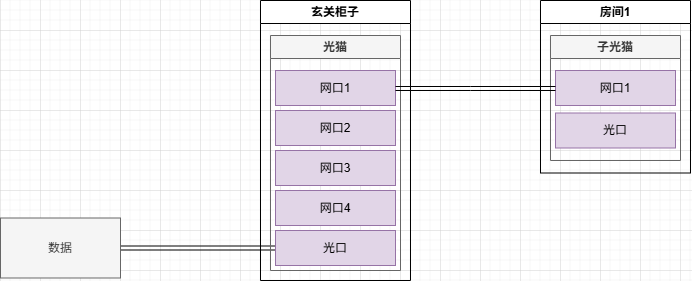
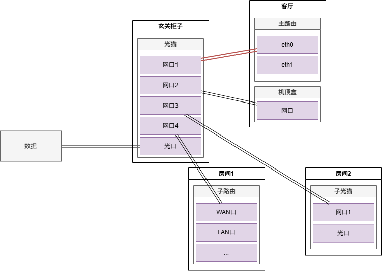
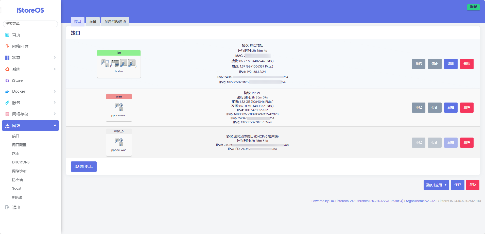
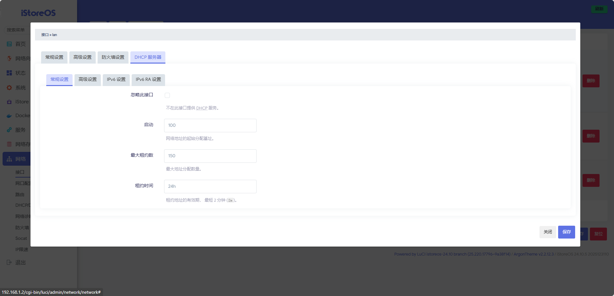
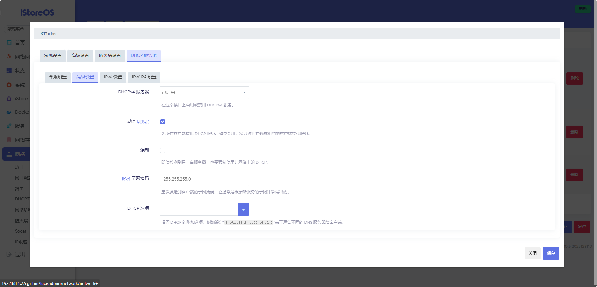
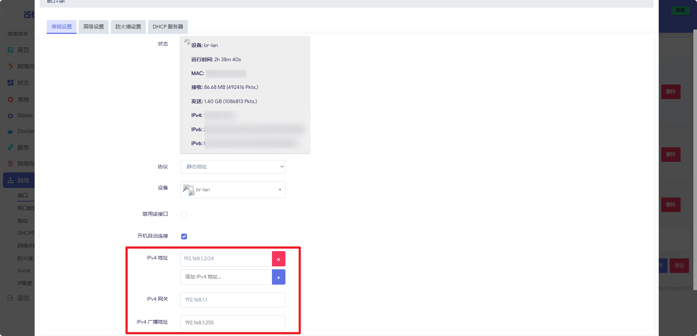
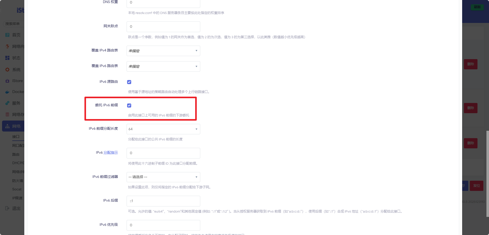
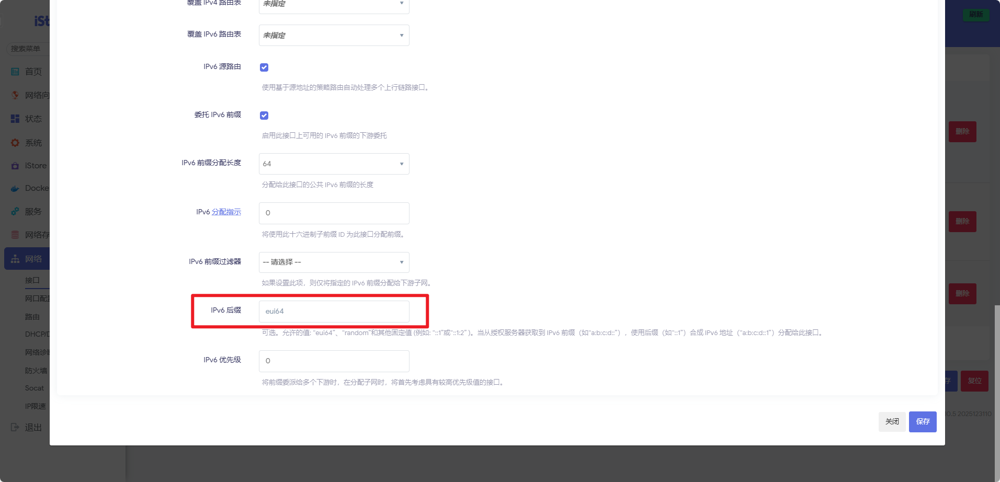
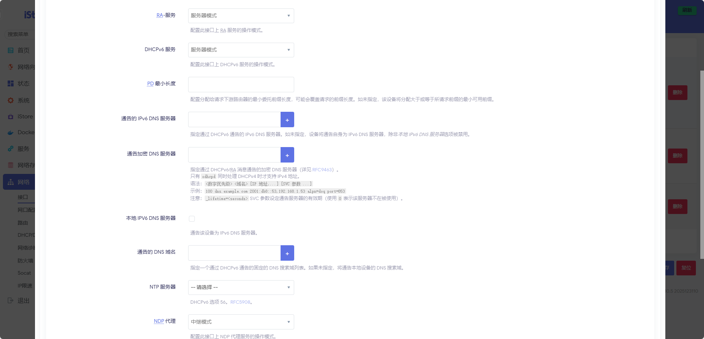
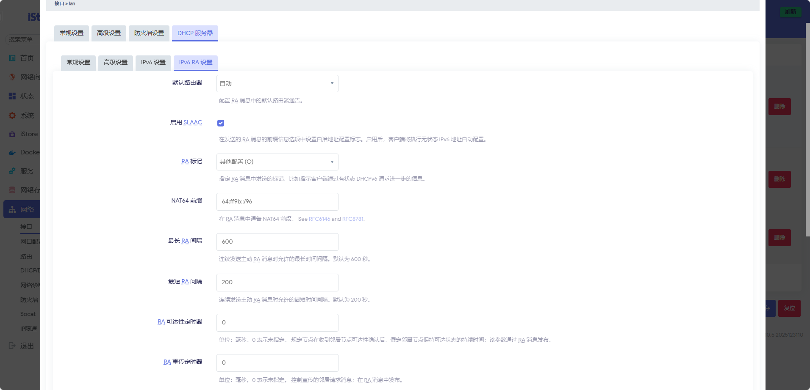

+++
title = "软路由和IStoreOS简单配置"
date = 2026-01-02T13:11:48+08:00
draft = false
categories = ["Hardware"]
tags = ["Hardware", "Router", "Network"]
image = "https://picsum.photos/seed/f9d66dfe/800/600"
slug = "f9d66dfe"
+++

## 环境

> 环境部分**因人而异**

家中是FTTR环境

~~请不要吐槽为什么没接到光口上，我也不知道师傅什么意思~~

客厅两个网口，一个接到主路由，一个留着连IPTV

由于光猫性能不错，因此连到主路由的（红）线再VLAN划分一下，然后光猫当AP

再拿个子路由过来，扩大网络范围

## 基础配置

给主路由安装上IStoreOS，光猫改成桥接模式，将光猫的VLAN、DHCP、防火墙等等操作完毕后，来到主路由侧

### DHCP

在路由拨号后，首先要配置DHCP

确保光猫的DHCP Enable和DHCP Server是关闭状态，在`网络`-`接口`处，编辑接口lan-`DHCP服务器`：
- `常规设置`-`忽略此接口` 关闭
- `高级设置`-`DHCPv4服务器` 启用

> 如果你做好了VLAN复用或者把路由的一个lan口接回光猫，可以在网关设置中把光猫和路由设置成同一网段，以便今后进入光猫管理界面
>
> 

### IPv6地址

将接口wan中`高级设置`-`委托IPv6前缀`启用，接口lan中也同样操作

> 建议将接口wan和接口lan的`IPv6后缀`改成`random`或者`eui64`，可以减少被攻击的概率
>
> 

接着，在接口lan的`DHCP服务器`-`IPv6设置`：
- `RA-服务`、`DHCPv6服务` 服务器模式
- `NDP代理` 中继模式

设置完成打开`DHCP服务器`-`IPv6 RA设置`：
- `启用SLAAC` 启用
- `RA标记` M和H不用选上，O可选可不选

> 解释下以上操作大概用处，粗糙解释看看即可
>
> - `NTP`可以让设备找到路由器、以及其他设备
>
> - `RA服务`可以让路由器给设备发送RA消息，设备可以根据RA消息设置IPv6和DNS等等配置
>
> - `SLAAC`和`RA服务`配合使用，可以在无DHCPv6服务器的情况下充当DHCP的作用
>
> - `RA标记`可以设定哪些配置由SLAAC完成，哪些部分由DHCP完成：M关闭可以让SLAAC分配IPv6地址、O开启让DHCP设置DNS、H一般不开也不知道啥用
